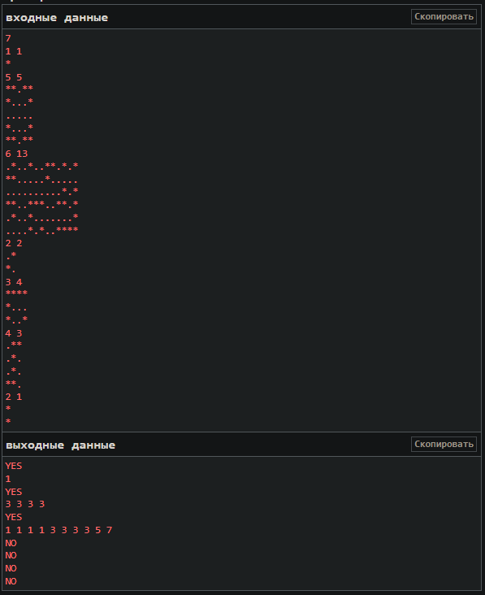

#  Г-образный морской бой

Поле для игры в г-образный морской бой представляет собой прямоугольник n×m (n строк, m столбцов).

Каждая клетка поля либо пустая (ей соответствует символ '.'), либо занята палубой корабля (ей соответствует символ '*').

На корректном стартовом состоянии поля находится несколько (один или более) кораблей. Корабли бывают четырёх видов: однопалубные, трёхпалубные, пятипалубные и семипалубные. Каждый корабль имеет вид кириллической буквы Г (в случае однопалубного корабля она вырожденная).

*    **    ***    ****
     *.    *..    *...
           *..    *...
                  *...
На рисунке слева направо изображены всевозможные корабли в порядке от меньшего к большему. Обратите внимание, что корабли могут быть повернуты на 90, 180, 270 градусов.

По заданному полю проверьте, что оно корректное и выведите размеры всех кораблей в отсортированном порядке.

## Поле корректное, если:

состоит только из точек (пустых клеток) и кораблей;
корабли не пересекаются и не касаются (даже углами).
Разберите примеры ниже, если остались вопросы по формулировке корректности поля.

## Входные данные
В первой строке записано целое число t (1≤t≤100) — количество наборов входных данных в тесте.

Первая строка каждого набора входных данных содержит пару целых чисел n, m (1≤n,m≤15) — размеры поля.

Далее входные данные содержат n строк по m символов в каждой. Каждый символ — это либо точка '.', либо звёздочка '*'. Хотя бы один символ поля равен звёздочке '*'.

## Выходные данные
Для каждого набора входных данных выведите:

либо YES в первую строку и размеры всех кораблей на поле в неубывающем порядке во вторую, если поле корректно;
либо NO, если поле некорректно.
## Пример
